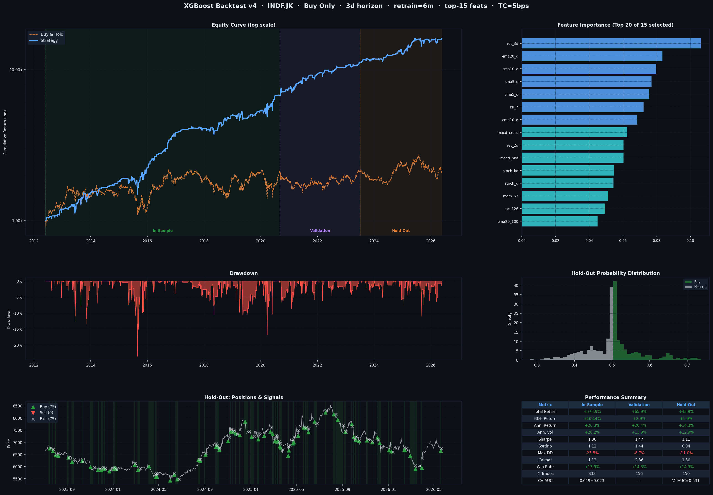
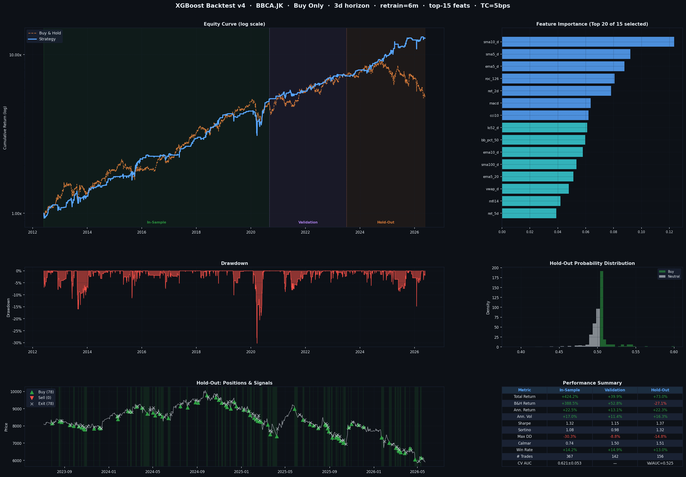
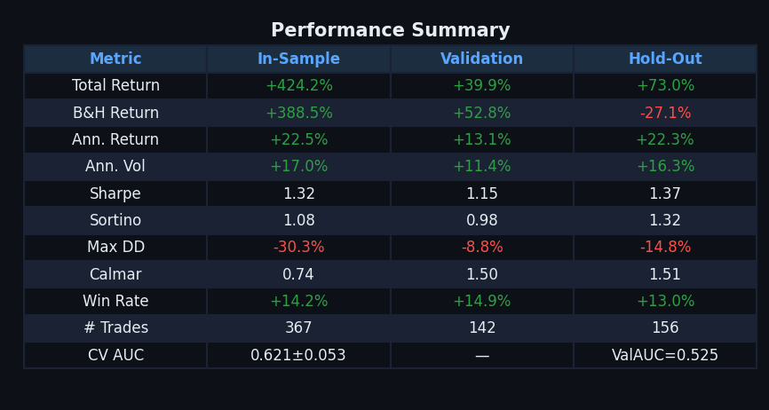

# XGBoost Stock Backtesting Framework

> *Can a machine learning model beat buy-and-hold on Indonesian stocks?*  
> This project builds, tests, and rigorously evaluates a trading strategy powered by XGBoost — one of the most battle-tested ML algorithms in quantitative finance.



---

## What Is This Project?

Imagine you could teach a computer to study 15 years of stock price history — every wiggle, every trend, every indicator traders use — and learn *when* a stock is most likely to rise in the next few days. That's exactly what this framework does.

It trains an **XGBoost machine learning model** on historical stock data, then **simulates trading** based on that model's signals, and finally presents a full performance dashboard so you can judge for yourself: *is this strategy worth anything in the real world?*

The framework is built with a **trader's mindset**: it accounts for realistic trade execution, transaction costs, and — critically — makes sure the model never "cheats" by peeking at future data during training.

---

## Goals

| Goal | How It's Addressed |
|---|---|
| Predict short-term price direction | XGBoost classifier on 80+ technical features |
| Avoid overfitting (the #1 failure of ML in trading) | Walk-forward retraining + purged cross-validation + feature selection |
| Simulate real-world trading | Execution at next day's open price + transaction costs |
| Measure true out-of-sample performance | Strict train / validation / hold-out data splits |
| Understand *why* the model trades | Feature importance chart |

---

## How It Works — Step by Step

### 1. Data Download
Stock price data (OHLCV: Open, High, Low, Close, Volume) is downloaded automatically via `yfinance` for any ticker — Indonesian stocks (`.JK`), US stocks, or any market supported by Yahoo Finance. The default lookback is **15 years**.

---

### 2. Feature Engineering (~80 Technical Indicators)
Raw prices are transformed into features that describe the *current market state*. These are the same signals technical traders use, but fed to a machine instead of human eyes:

- **Trend features** — price relative to SMA(5/10/20/50/100/200), EMA crossovers, MACD, ADX
- **Momentum features** — rate of change (ROC), past returns (1d to 63d), RSI (7/14/21)
- **Volatility features** — rolling standard deviation, ATR (Average True Range), Bollinger Band width
- **Volume features** — OBV (On-Balance Volume), MFI (Money Flow Index), volume ratio vs. moving average
- **Statistical features** — rolling skewness, kurtosis, 52-week high/low deviation
- **Calendar features** — day of week, month (captures seasonality)

All features are **normalized relative to price** (e.g., `(Close - SMA) / SMA`) so they stay comparable across different stocks and time periods.

---

### 3. Labeling
The model learns to predict: *"Will this stock rise by at least X% over the next N days?"*

- **Buy-Only mode**: Label = `1` (buy signal) if the stock gains > `label_pct`% in `forward_days` trading days, else `0` (stay flat).
- **Buy-Sell mode**: Adds a `-1` label (sell/short signal) for stocks expected to drop.

The default is **3-day horizon** with a **1% threshold** — asking the model to predict meaningful near-term moves.

---

### 4. Data Splitting (The Most Critical Step)
The dataset is split **chronologically** — never randomly — into three non-overlapping periods:

```
|──────────── In-Sample (60%) ────────────|── Validation (20%) ──|── Hold-Out (20%) ──|
         Model is trained here              Hyperparameter tuning    True test of reality
```

- **In-Sample**: Where the model learns patterns.
- **Validation**: Used to stop training early (prevent overfitting) and tune thresholds.
- **Hold-Out**: The model has *never seen this data*. Performance here is the only honest measure.

> **Why this matters**: Most "backtests" you see online are overfit — the model was implicitly tuned on the test data. This framework enforces a strict wall between learning and evaluation.

---

### 5. Model Training

**XGBoost** (eXtreme Gradient Boosting) is an ensemble of decision trees that learns from its own mistakes iteratively. It's the algorithm behind many winning solutions in quantitative trading competitions.

Key anti-overfitting measures baked in:

| Parameter | Setting | Effect |
|---|---|---|
| `max_depth = 3` | Shallow trees | Can't memorize noise |
| `learning_rate = 0.02` | Small steps | Generalizes better |
| `colsample_bytree = 0.5` | Use 50% of features per tree | Forces diversity |
| `min_child_weight = 8` | Need 8+ samples per leaf | Avoids spurious splits |
| `reg_alpha/lambda` | L1 + L2 regularization | Penalizes complexity |
| `early_stopping_rounds = 40` | Stop if val loss doesn't improve | Prevents overtraining |
| `scale_pos_weight` | Auto class balancing | Handles rare buy signals |

---

### 6. Purged Walk-Forward Cross-Validation

Standard k-fold cross-validation is **broken for time series** — it lets the model train on data *after* the test period, leaking future information.

This framework uses **Purged + Embargoed Walk-Forward CV**:

1. Folds are strictly ordered in time (no shuffling).
2. A **5-row embargo gap** is added between training and validation folds.

This gap removes rows that might share information with the test period (since a 3-day forward label computed on day T overlaps with prices on days T+1 through T+3).

The output is a **CV AUC score** — a leakage-free estimate of how well the model distinguishes buy opportunities from non-opportunities.

---

### 7. Feature Selection

Training on all 80+ features often hurts performance — noise overwhelms signal. After initial training, the framework ranks features by **XGBoost importance** and keeps only the **top-K** (default: 15). The model is then retrained on this curated feature set.

> In the example dashboard (BBCA.JK), the top features were SMA deviations, EMA distances, rate-of-change, MACD, and Bollinger Band position — classic trend-following and mean-reversion signals.

---

### 8. Walk-Forward Retraining (Expanding Window)

Markets change. A model trained in 2015 may be completely wrong in 2023. To handle this:

- The model starts with knowledge up to the end of the in-sample period.
- Every **N months** (default: 6), the model **retrains from scratch** on all data seen so far.
- It then predicts only the *next* chunk of data — never the future.

This is how professional quant funds operate. It's the difference between a static snapshot and a living, adapting system.

```
|─ IS train ─|── retrain ──|── retrain ──|── retrain ──|
              ↓              ↓              ↓
           predict →      predict →      predict →
```

---

### 9. Signal Generation

Raw probability outputs from the model are converted to trading signals using a **dual filter**:

1. **Percentile rank filter**: Only fire a BUY when the model's confidence is in the **top 25%** of all signals (so it only acts on its strongest convictions).
2. **Minimum probability floor**: The raw buy probability must also exceed **0.40** (avoids acting on marginal signals near the 50/50 boundary).

An optional **SMA regime filter** (e.g., SMA-200) can restrict longs to bull markets only, significantly reducing drawdown.

---

### 10. Realistic Backtest Engine

The backtest is designed to be as close to real trading as possible:

- **Signal at Close[T] → Execute at Open[T+1]**: You see the signal after market close, then execute at the following morning's open. No cheating with same-bar fills.
- **Transaction costs**: Default **5 basis points (0.05%)** per trade, applied on position changes.
- **Position tracking**: Cumulative equity curve, drawdown, and per-trade statistics are all computed.

---

## How to Read the Dashboard

The dashboard produced by the script has 6 panels:



### Top-Left: Equity Curve (Log Scale)
- **Blue line** = Strategy performance
- **Orange dashed line** = Buy & Hold benchmark
- Three shaded regions mark **In-Sample**, **Validation**, and **Hold-Out** periods
- Log scale lets you compare percentage gains fairly across time

> You want the blue line to stay above orange, especially in the **Hold-Out** region — that's the only part that counts.

### Top-Right: Feature Importance
- Shows which of the top-15 selected features drive the model's decisions
- **Brighter blue** = above-median importance
- In the BBCA example: `sma10_d` (deviation from 10-day SMA) dominated — the model learned to buy pullbacks from trend.

### Middle-Left: Drawdown
- Shows how far the strategy fell from its peak at any point in time
- Shallower and shorter drawdowns = better risk management
- A max drawdown of -14.8% on BBCA hold-out means the worst losing streak cut equity by ~15%

### Middle-Right: Hold-Out Probability Distribution
- Shows the distribution of buy probabilities during the hold-out period
- **Green** = days where a BUY signal was fired
- **Gray** = neutral days
- A clean separation between the two clusters means the model is decisive

### Bottom-Left: Hold-Out Positions & Signals
- Price chart overlaid with trade markers
- 🔺 Green triangles = BUY entries | 🔻 Red triangles = SELL entries | ✕ = exits
- Green shading = periods when the strategy holds a long position

### Bottom-Right: Performance Summary Table

| Metric | What It Means | Good Value |
|---|---|---|
| **Total Return** | Cumulative gain over the period | Higher than B&H |
| **B&H Return** | What you'd earn just holding | The benchmark to beat |
| **Ann. Return** | Annualized compound return | > 15% is strong |
| **Ann. Vol** | Annualized daily volatility | Lower = smoother ride |
| **Sharpe** | Return per unit of risk | > 1.0 is good, > 1.5 is great |
| **Sortino** | Like Sharpe but only penalizes *downside* volatility | > 1.0 is solid |
| **Max DD** | Worst peak-to-trough drawdown | Closer to 0% is better |
| **Calmar** | Ann. Return / Max Drawdown | > 1.0 means returns justify the risk |
| **Win Rate** | % of trading days that were profitable | Often 50–60% is fine with good Sharpe |
| **# Trades** | Total position changes (entries + exits) | Lower = less friction |
| **CV AUC** | Cross-validation discrimination score | > 0.55 is meaningful signal |




---

## Installation & Usage

### Requirements
```bash
pip install yfinance xgboost scikit-learn pandas numpy matplotlib joblib python-dateutil
```

### Run
```bash
python ML_Stock_Backtest.py
```

The output will be:
- A printed performance table in the terminal
- A saved dashboard PNG: `xgb_backtest_dashboard.png`
- A saved model bundle: `xgb_{TICKER}_{MODE}_{N}d.pkl` (for live use)

### Configuration
Edit the `CONFIG` dict at the top of the file:

```python
CONFIG = dict(
    ticker          = "BBCA.JK",   # Any Yahoo Finance ticker
    years           = 15,           # Years of history to download
    mode            = "buy_only",   # "buy_only" or "buy_sell"
    forward_days    = 3,            # Prediction horizon (trading days)
    label_pct       = 1.0,          # % move threshold to label as "buy"
    retrain_months  = 6,            # Walk-forward retraining frequency
    top_k_features  = 15,           # Feature selection cutoff
    regime_sma      = None,         # e.g. 200 → only buy above SMA(200)
    buy_pct         = 25,           # Top N% confidence percentile for BUY
    min_prob_floor  = 0.40,         # Minimum raw probability to trade
    transaction_cost_bps = 5,       # Round-trip cost in basis points
)
```

---

## Important Caveats

This is a **research and educational framework**, not a live trading system. Before drawing conclusions:

- **Past performance does not guarantee future results.** Even a genuine edge can disappear as markets adapt.
- **Hold-Out performance is the only honest signal.** In-sample and validation numbers are expected to look good.
- **Transaction costs matter more at high frequency.** More trades = more friction. The default 5bps is optimistic for some brokers.
- **This framework does not account for liquidity, slippage, or market impact** — all of which matter for real execution.
- **Always paper-trade first** before committing real capital to any strategy derived from this analysis.

---

## Key Design Decisions

| Decision | Rationale |
|---|---|
| XGBoost over deep learning | More robust on tabular data with limited samples; interpretable |
| Expanding window (not rolling) | Maximizes training data; avoids discarding early regime information |
| Percentile-rank signals (not raw probs) | Self-adjusting threshold; robust to distribution shift |
| Open-price execution | Removes look-ahead bias; more realistic than close-to-close |
| RobustScaler | Less sensitive to extreme outliers than StandardScaler |
| `scale_pos_weight` | Handles class imbalance without undersampling |

---

## Repository Structure

```
├── ML_Stock_Backtest.py              # Main framework
├── README.md                         # This file
├── BBCA_JK_xgb_backtest_dashboard.png  # Example dashboard output
└── xgb_BBCA.JK_buy_only_3d.pkl      # Saved model bundle (after running)
```

---

## License

MIT — use freely, contribute back if you improve it.

---

*Built with Python · XGBoost · scikit-learn · yfinance · matplotlib*
